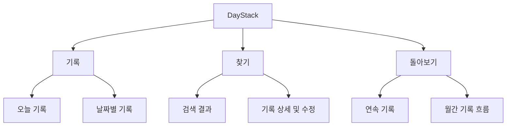

# DayStack UX·디자인 설계서

## 1. 디자인 방향

추천 방향은 `A Quiet Journal`을 시각적 정서로 삼고 `C Timeline Stack`을 탐색 구조로 결합하는 것이다. `B Progress Dashboard`의 통계 요소는 작고 차분한 보조 정보로만 사용한다.

DayStack이 Todo나 성과 관리 도구처럼 보이지 않도록 체크박스, 완료율, 진행률, 트로피, 레벨, 압박성 목표 문구를 사용하지 않는다.

추천 메시지:

> 짧게 남겨도, 나중에는 흐름이 됩니다.

내비게이션 라벨은 `기록 / 찾기 / 돌아보기` 세 개로 제한한다.

## 2. 정보 구조



데스크톱은 좌측 내비게이션, 모바일은 하단 내비게이션을 사용한다. 기본 진입 화면은 항상 오늘 기록이다.

## 3. 화면 설계

### 기록 화면

- 날짜와 이전/다음 이동
- `오늘을 네 가지 질문으로 남겨보세요.` 안내
- 네 개의 프롬프트를 하나의 문서 흐름으로 배치
- 입력 영역마다 항상 보이는 label
- `저장 중`, `저장됨 · 오후 9:42` 상태
- CTA는 `기록 저장`

네 프롬프트는 큰 카드 4개가 아니라 번호·질문·textarea가 이어지는 긴 기록 문서로 표현한다.

### 찾기 화면

- 상단 검색창
- 날짜순 월 그룹 타임라인
- 최신 월은 기본으로 펼치고 과거 월은 접어서 장기 기록도 짧게 탐색
- 월 헤더는 `연도 월 · 기록 수`와 `aria-expanded`/`aria-controls`를 제공
- 결과마다 날짜, 일치한 프롬프트명, 한두 줄 발췌
- 프롬프트 라벨은 텍스트를 유지하면서 저채도 배경·텍스트·왼쪽 포인트 선으로 구분
- 검색 결과 클릭 시 해당 날짜 상세 화면
- 카드 그리드 대신 구분선 기반 타임라인

### 상세/수정 화면

읽기 모드에서는 문서처럼 표시하고, `수정`을 눌렀을 때만 textarea로 전환한다. 이전/다음 날짜 이동을 제공한다.

### 돌아보기 화면

- 현재 연속 기록
- 최장 연속 기록
- 이번 달 기록일 수
- 기록된 날짜의 월간 흐름
- 날짜 선택 시 해당 기록으로 이동

큰 KPI 카드 네 개, 원형 달성률, 배지, 붉은 실패 표시를 사용하지 않는다.

## 4. 상태 설계

| 상태 | 문구/행동 |
|---|---|
| 첫 사용 | `한 문장만 남겨도 괜찮습니다.` + 기록 시작 |
| 기록 없는 날짜 | `이 날에는 기록이 없습니다.` + 이 날짜 기록하기 |
| 검색 결과 없음 | 검색어를 바꾸거나 필터를 지우도록 안내 |
| 저장 실패 | 내용을 유지하고 `다시 저장` 제공 |
| localStorage 오류 | 저장 불가 원인과 JSON 백업 안내 |
| 부분 작성 | 작성된 내용만 저장할지 인라인 안내 |

## 5. 디자인 토큰

```css
:root {
  --ds-canvas: #f6f4ef;
  --ds-surface: #fcfbf8;
  --ds-ink: #292a26;
  --ds-muted: #686961;
  --ds-divider: #d9d8d0;
  --ds-accent: #4f6658;
  --ds-accent-soft: #e5ece7;
  --ds-danger: #a33f36;
  --ds-focus: #245db2;
}
```

- 기본 글꼴은 `Pretendard` 또는 `SUIT` 중 하나로 고정한다.
- 본문은 16px 이상, line-height 1.6 이상으로 둔다.
- 화면 제목은 데스크톱 28~32px, 모바일 22~26px.
- 간격은 4/8/12/16/24/32/48/64px 체계.
- radius는 4/8px 중심, border는 1px, 그림자는 최소화.
- 주 색상은 녹색 계열 하나로 제한하고 보라색/인디고 그라디언트를 사용하지 않는다.

## 6. 반응형 기준

- 데스크톱: 좌측 내비게이션 200~224px, 본문 최대 너비 720px.
- 태블릿: 본문 좌우 여백 24~32px, 달력 글자 크기 유지.
- 모바일: 하단 내비게이션, 프롬프트 세로 흐름, 320px 이상 가로 스크롤 없음.
- 모바일에서 달력이 읽히지 않으면 날짜 목록으로 바꾼다.
- hover에 의존하지 않고 모든 핵심 행동은 키보드와 터치로 가능해야 한다.

## 7. 접근성 기준

- `header`, `nav`, `main` 랜드마크와 화면당 `h1` 하나.
- textarea마다 visible label 제공.
- 키보드로 날짜 이동, 검색, 수정, 저장 가능.
- 터치 타깃 최소 44×44px, focus ring 최소 2px.
- 저장 상태와 오류는 `aria-live`로 전달.
- 기록 여부를 색상만으로 전달하지 않는다.
- `prefers-reduced-motion`을 지원한다.
- 아이콘 버튼에는 accessible name을 제공한다.
